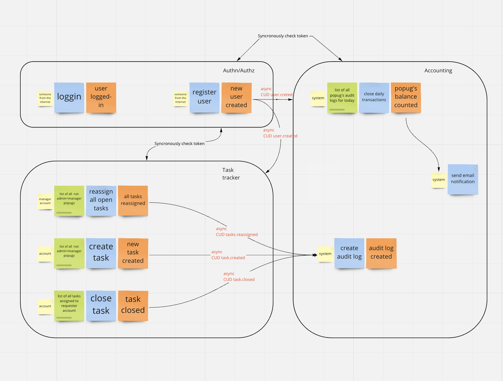
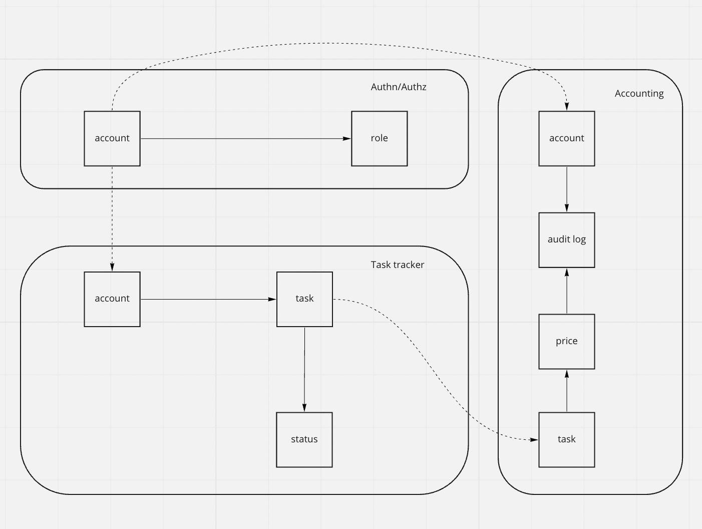

# Popug's Service architecture

[link to Miro schema with event storming and model](https://miro.com/app/board/uXjVPVrUm-I=/?share_link_id=687424757318)

### Domains:
* Auth
* Tasks tracking
* Accounting

### Services:
* Auth
* Tasks tracking
* Accounting

In this architecture: Domains == Services

Services connections:

link to schema https://miro.com/app/board/uXjVPVrUm-I=/?share_link_id=687424757318
1. All services synchronously go to Auth service to check token
2. Auth service asynchronously post User CUD events to Tasks Tracking and Accounting services
3. Task service asynchronously post Task CUD events to accounting service

!!! I don't think that we need any business events in this architecture, 
correct me if I'm wrong.
